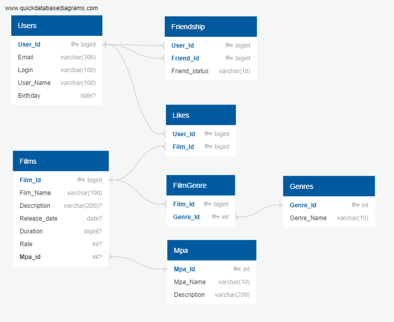

# Filmorate

### Описание

Представьте, что после тяжелого дня вы решили отдохнуть и провести вечер за просмотром фильма. Вкусная еда уже готовится, любимый плед уютно свернулся на кресле — а вы всё ещё не выбрали, что же посмотреть!
Фильмов много — и с каждым годом становится всё больше. Чем их больше, тем больше разных оценок. Чем больше оценок, тем сложнее сделать выбор.
Данное приложение представляет собой бэкенд для сервиса, который будет работать с фильмами и оценками пользователей, а также возвращать X-топ фильмов, рекомендованных к просмотру. Теперь ни вам, ни вашим друзьям не придётся долго размышлять, что посмотреть вечером.

#### Приложение умеет работать:
<table>
  <tbody>
    <tr>
      <th><b> С пользователями</b></th>
      <th><b> С фильмами</b></th>
    </tr>
    <tr>
        <td>
            <ul><li>Добавлять;</li>
            <li>Редактировать;</li>
            <li>Выводить список всех пользователей;</li>
            <li>Выводить информацию о конкретном пользователе;</li>
            <li>Добавлять друзей;</li>
            <li>Удалять из друзей;</li>
            <li>Выводить список друзей конкретного пользователя;</li>
            <li>Выводить список общих друзей.</li></ul>
        </td>
        <td>
            <ul><li>Добавлять;</li>
            <li>Редактировать;</li>
            <li>Выводить список всех фильмов;</li>
            <li>Выводить информацию о конкретном фильме;</li>
            <li>Ставить лайки;</li>
            <li>Удалять лайки;</li>
            <li>Выводить Х-топ популярных фильмов.</li></ul>
        </td>
    </tr>
  </tbody>
</table>
 
 

---

### Документация
#### Swagger API
Swagger API можно нати по ссылке http://localhost:8080/swagger-ui/index.html после запуска проекта, либо в статическом 
файле index.html в корне проекта
 
 

#### Модель базы данных

 
 

#### Примеры SQL-запросов
##### Получение всех фильмов
<pre>
    <code>SELECT * 
    FROM film</code>
</pre>

##### Получение топ 10 фильмов
<pre>
    <code>SELECT f.*
    FROM film f
    JOIN like l ON f.id=l.filmid
    GROUP BY l.filmid
    ORDER BY COUNT(l.userid) DESC
    LIMIT 10</code>
</pre>

##### Получение названий жанров для фильма №2
<pre>
    <code>SELECT f.name, g.name
    FROM genre g
    JOIN filmgenre fg ON g.id=fg.genreid
    JOIN film f ON fg.filmid=f.id
    WHERE f.id=2</code>
</pre>